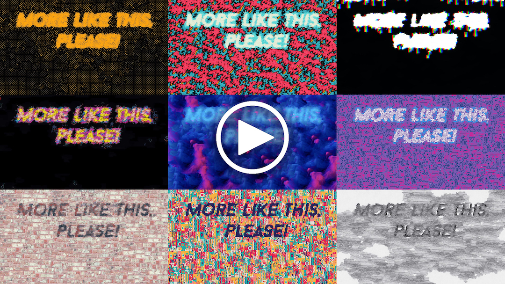
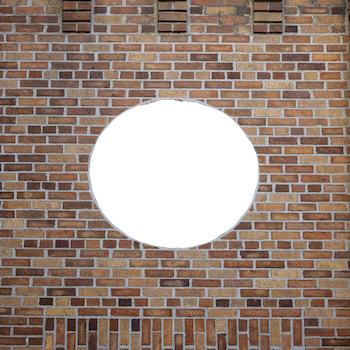

# 🎨 texture-synthesis

[](https://github.com/EmbarkStudios/texture-synthesis/actions?workflow=CI)
[](https://crates.io/crates/texture-synthesis)
[](https://docs.rs/texture-synthesis)
[](CODE_OF_CONDUCT.md)
[](http://embark.games)

A light Rust API for _Multiresolution Stochastic Texture Synthesis_ [1], a non-parametric example-based algorithm for image generation.

The repo also includes multiple code examples to get you started (along with test images), and you can find a compiled binary with a command line interface under the release tab.

Also see our talk [_More Like This, Please! Texture Synthesis and Remixing from a Single Example_](https://youtu.be/fMbK7PYQux4) which explains this technique and the background more in-depth:

[](https://www.youtube.com/watch?v=fMbK7PYQux4&t=6m57s)

## Features and examples

### 1. Single example generation


Generate similar-looking images from a single example.

#### API - [01_single_example_synthesis](lib/examples/01_single_example_synthesis.rs)

```rust
use texture_synthesis as ts;

fn main() -> Result<(), ts::Error> {
    //create a new session
    let texsynth = ts::Session::builder()
        //load a single example image
        .add_example(&"imgs/1.jpg")
        .build()?;

    //generate an image
    let generated = texsynth.run(None);

    //save the image to the disk
    generated.save("out/01.jpg")
}
```

#### CLI

`cargo run --release -- --out out/01.jpg generate imgs/1.jpg`

You should get the following result with the images provided in this repo:


### 2. Multi example generation


We can also provide multiple example images and the algorithm will "remix" them into a new image.

#### API - [02_multi_example_synthesis](lib/examples/02_multi_example_synthesis.rs)

```rust
use texture_synthesis as ts;

fn main() -> Result<(), ts::Error> {
    // create a new session
    let texsynth = ts::Session::builder()
        // load multiple example image
        .add_examples(&[
            &"imgs/multiexample/1.jpg",
            &"imgs/multiexample/2.jpg",
            &"imgs/multiexample/3.jpg",
            &"imgs/multiexample/4.jpg",
        ])
        // we can ensure all of them come with same size
        // that is however optional, the generator doesnt care whether all images are same sizes
        // however, if you have guides or other additional maps, those have to be same size(s) as corresponding example(s)
        .resize_input(ts::Dims {
            width: 300,
            height: 300,
        })
        // randomly initialize first 10 pixels
        .random_init(10)
        .seed(211)
        .build()?;

    // generate an image
    let generated = texsynth.run(None);

    // save the image to the disk
    generated.save("out/02.jpg")?;

    //save debug information to see "remixing" borders of different examples in map_id.jpg
    //different colors represent information coming from different maps
    generated.save_debug("out/")
}
```

#### CLI

`cargo run --release -- --rand-init 10 --seed 211 --in-size 300x300 -o out/02.png --debug-out-dir out generate imgs/multiexample/1.jpg imgs/multiexample/2.jpg imgs/multiexample/3.jpg imgs/multiexample/4.jpg`

You should get the following result with the images provided in this repo:


### 3. Guided Synthesis


We can also guide the generation by providing a transformation "FROM"-"TO" in a form of guide maps

#### API - [03_guided_synthesis](lib/examples/03_guided_synthesis.rs)

```rust
use texture_synthesis as ts;

fn main() -> Result<(), ts::Error> {
    let texsynth = ts::Session::builder()
        // NOTE: it is important that example(s) and their corresponding guides have same size(s)
        // you can ensure that by overwriting the input images sizes with .resize_input()
        .add_example(ts::Example::builder(&"imgs/2.jpg").with_guide(&"imgs/masks/2_example.jpg"))
        // load target "heart" shape that we would like the generated image to look like
        // now the generator will take our target guide into account during synthesis
        .load_target_guide(&"imgs/masks/2_target.jpg")
        .build()?;

    let generated = texsynth.run(None);

    // save the image to the disk
    generated.save("out/03.jpg")
}
```

#### CLI

`cargo run --release -- -o out/03.png generate --target-guide imgs/masks/2_target.jpg --guides imgs/masks/2_example.jpg -- imgs/2.jpg`

**NOTE:** Note the use of `--` to delimit the path to the example `imgs/2.jpg`, if you don't specify `--`, the path
to the example will be used as another guide path and there won't be any examples.

You should get the following result with the images provided in this repo:


### 4. Style Transfer


Texture synthesis API supports auto-generation of example guide maps, which produces a style transfer-like effect.

#### API - [04_style_transfer](lib/examples/04_style_transfer.rs)

```rust
use texture_synthesis as ts;

fn main() -> Result<(), ts::Error> {
    let texsynth = ts::Session::builder()
        // load example which will serve as our style, note you can have more than 1!
        .add_examples(&[&"imgs/multiexample/4.jpg"])
        // load target which will be the content
        // with style transfer, we do not need to provide example guides
        // they will be auto-generated if none were provided
        .load_target_guide(&"imgs/tom.jpg")
        .guide_alpha(0.8)
        .build()?;

    // generate an image that applies 'style' to "tom.jpg"
    let generated = texsynth.run(None);

    // save the result to the disk
    generated.save("out/04.jpg")
}
```

#### CLI

`cargo run --release -- --alpha 0.8 -o out/04.png transfer-style --style imgs/multiexample/4.jpg --guide imgs/tom.jpg`

You should get the following result with the images provided in this repo:


### 5. Inpaint


We can also fill-in missing information with inpaint. By changing the seed, we will get different version of the 'fillment'.

#### API - [05_inpaint](lib/examples/05_inpaint.rs)

```rust
use texture_synthesis as ts;

fn main() -> Result<(), ts::Error> {
    let texsynth = ts::Session::builder()
        // let the generator know which part we would like to fill in
        // if we had more examples, they would be additional information
        // the generator could use to inpaint
        .inpaint_example(
            &"imgs/masks/3_inpaint.jpg",
            // load a "corrupted" example with missing red information we would like to fill in
            ts::Example::builder(&"imgs/3.jpg")
                // we would also like to prevent sampling from "corrupted" red areas
                // otherwise, generator will treat that those as valid areas it can copy from in the example,
                // we could also use SampleMethod::Ignore to ignore the example altogether, but we
                // would then need at least 1 other example image to actually source from
                // example.set_sample_method(ts::SampleMethod::Ignore);
                .set_sample_method(&"imgs/masks/3_inpaint.jpg"),
            // Inpaint requires that inputs and outputs be the same size, so it's a required
            // parameter that overrides both `resize_input` and `output_size`
            ts::Dims::square(400),
        )
        // Ignored
        .resize_input(ts::Dims::square(200))
        // Ignored
        .output_size(ts::Dims::square(100))
        .build()?;

    let generated = texsynth.run(None);

    //save the result to the disk
    generated.save("out/05.jpg")
}
```

#### CLI

Note that the `--out-size` parameter determines the size for all inputs and outputs when using inpaint!

`cargo run --release -- --out-size 400 --inpaint imgs/masks/3_inpaint.jpg -o out/05.png generate imgs/3.jpg`

You should get the following result with the images provided in this repo:


### 6. Inpaint Channel



Instead of using a separate image for our inpaint mask, we can instead obtain the information from a specific
channel. In this example, the alpha channel is a circle directly in the middle of the image.

#### API - [06_inpaint_channel](lib/examples/06_inpaint_channel.rs)

```rust
use texture_synthesis as ts;

fn main() -> Result<(), ts::Error> {
    let texsynth = ts::Session::builder()
        // Let the generator know that it is using 
        .inpaint_example_channel(
            ts::ChannelMask::A,
            &"imgs/bricks.png",
            ts::Dims::square(400),
        )
        .build()?;

    let generated = texsynth.run(None);

    //save the result to the disk
    generated.save("out/06.jpg")
}
```

#### CLI

`cargo run --release -- --inpaint-channel a -o out/06.png generate imgs/bricks.jpg`

You should get the following result with the images provided in this repo:


### 7. Tiling texture


We can make the generated image tile (meaning it will not have seams if you put multiple images together side-by-side). By invoking inpaint mode together with tiling, we can make an existing image tile.

#### API - [07_tiling_texture](lib/examples/07_tiling_texture.rs)

```rust
use texture_synthesis as ts;

fn main() -> Result<(), ts::Error> {
    // Let's start layering some of the "verbs" of texture synthesis
    // if we just run tiling_mode(true) we will generate a completely new image from scratch (try it!)
    // but what if we want to tile an existing image?
    // we can use inpaint!

    let texsynth = ts::Session::builder()
        // load a mask that specifies borders of the image we can modify to make it tiling
        .inpaint_example(
            &"imgs/masks/1_tile.jpg",
            ts::Example::new(&"imgs/1.jpg"),
            ts::Dims::square(400),
        )
        //turn on tiling mode!
        .tiling_mode(true)
        .build()?;

    let generated = texsynth.run(None);

    generated.save("out/07.jpg")
}
```

#### CLI

`cargo run --release -- --inpaint imgs/masks/1_tile.jpg --out-size 400 --tiling -o out/07.bmp generate imgs/1.jpg`

You should get the following result with the images provided in this repo:


### 8. Repeat texture synthesis transform on a new image


We can re-apply the coordinate transformation performed by texture synthesis onto a new image.

#### API - [08_repeat_transform](lib/examples/08_repeat_transform.rs)

```rust
use texture_synthesis as ts;

fn main() -> Result<(), ts::Error> {
    // create a new session
    let texsynth = ts::Session::builder()
        //load a single example image
        .add_example(&"imgs/1.jpg")
        .build()?;

    // generate an image
    let generated = texsynth.run(None);

    // now we can apply the same transformation of the generated image
    // onto a new image (which can be used to ensure 1-1 mapping between multiple images)
    // NOTE: it is important to provide same number of input images as the 
    // otherwise, there will be coordinates mismatch
    let repeat_transform_img = generated
        .get_coordinate_transform()
        .apply(&["imgs/1_bw.jpg"])?;

    // save the image to the disk
    // 08 and 08_repeated images should match perfectly
    repeat_transform_img.save("out/08_repeated.jpg").unwrap();
    generated.save("out/08.jpg")
}
```

#### CLI

1. First, we need to create a transform that can be reused

The notable bit here is the `--save-transform out/multi.xform` which creates the
file that can be used to generate new outputs with.

`cargo run --release -- --rand-init 10 --seed 211 --in-size 300x300 -o
out/02.png generate --save-transform out/multi.xform imgs/multiexample/1.jpg imgs/multiexample/2.jpg imgs/multiexample/3.jpg
imgs/multiexample/4.jpg`

2. Next, we use the `repeat` subcommand to repeat transform with different
inputs

The important bits here are the use of the `repeat` subcommand instead of
`generate`, and `--transform out/multi.xform` which tells what transform to
apply to the inputs. The only restriction is that the number of images you
specify must match the original number of examples **exactly**. If the input
images have different dimensions than the example images, they will be
automatically resized for you.

`cargo run --release -- -o out/02-repeated.png repeat --transform
out/multi.xform imgs/multiexample/1.jpg imgs/multiexample/2.jpg
imgs/multiexample/4.jpg imgs/multiexample/3.jpg`

Also note that the normal parameters that are used with `generate` don't apply
to the `repeat` subcommand and will be ignored.

### 9. Combining texture synthesis 'verbs'

We can also combine multiple modes together. For example, multi-example guided synthesis:


Or chaining multiple stages of generation together:


For more use cases and examples, please refer to the presentation ["More Like This, Please! Texture Synthesis and Remixing from a Single Example"](https://youtu.be/fMbK7PYQux4)

### Additional CLI functionality

Some functionality is only exposed through the CLI and not built into the library.

#### `flip-and-rotate`

This subcommand takes each example and performs flip and rotation transformations to it to generate additional example inputs for generation. This subcommand doesn't support target or example guides.

Example: `cargo run --release -- -o out/output.png flip-and-rotate imgs/1.jpg`

## Command line binary

* [Download the binary](https://github.com/EmbarkStudios/texture-synthesis/releases) for your OS.
* **Or** Install it from source.
  * [Install Rust](https://www.rust-lang.org/tools/install) - The minimum required version is `1.37.0`
  * [Clone this repo](https://help.github.com/en/articles/cloning-a-repository)
  * In a terminal `cd` to the directory you cloned this repository into
  * Run `cargo install --path=cli`
  * **Or** if you wish to see the texture as it is being synthesized `cargo install --path=cli --features="progress"`
* Open a terminal
* Navigate to the directory where you downloaded the binary, if you didn't just `cargo install` it
* Run `texture_synthesis --help` to get a list of all of the options and commands you can run
* Refer to the examples section in this readme for examples of running the binary

## Notes

* By default, generating output will use all of your logical cores
* When using multiple threads for generation, the output image is not guaranteed to be deterministic with the same inputs. To have 100% determinism, you must use a thread count of one, which can by done via
  * CLI - `texture-synthesis --threads 1`
  * API - `SessionBuilder::max_thread_count(1)`

## Limitations

* Struggles with complex semantics beyond pixel color (unless you guide it)
* Not great with regular textures (seams can become obvious)
* Cannot infer new information from existing information (only operates on what’s already there)
* Designed for single exemplars or very small datasets (unlike Deep Learning based approaches)

## Links/references

[1] [Opara & Stachowiak] ["More Like This, Please! Texture Synthesis and Remixing from a Single Example"](https://youtu.be/fMbK7PYQux4)

[2] [Harrison] Image Texture Tools

[3] [Ashikhmin] Synthesizing Natural Textures

[4] [Efros & Leung] Texture Synthesis by Non-parametric Sampling

[5] [Wey & Levoy] Fast Texture Synthesis using Tree-structured Vector Quantization

[6] [De Bonet] Multiresolution Sampling Procedure for Analysis and Synthesis of Texture Images

[7] All the test images in this repo are from [Unsplash](https://unsplash.com/)

## Contributing

We welcome community contributions to this project.

Please read our [Contributor Guide](CONTRIBUTING.md) for more information on how to get started.

## License

Licensed under either of

* Apache License, Version 2.0, ([LICENSE-APACHE](LICENSE-APACHE) or http://www.apache.org/licenses/LICENSE-2.0)
* MIT license ([LICENSE-MIT](LICENSE-MIT) or http://opensource.org/licenses/MIT)

at your option.

### Contribution

Unless you explicitly state otherwise, any contribution intentionally submitted for inclusion in the work by you, as defined in the Apache-2.0 license, shall be dual licensed as above, without any additional terms or conditions.
